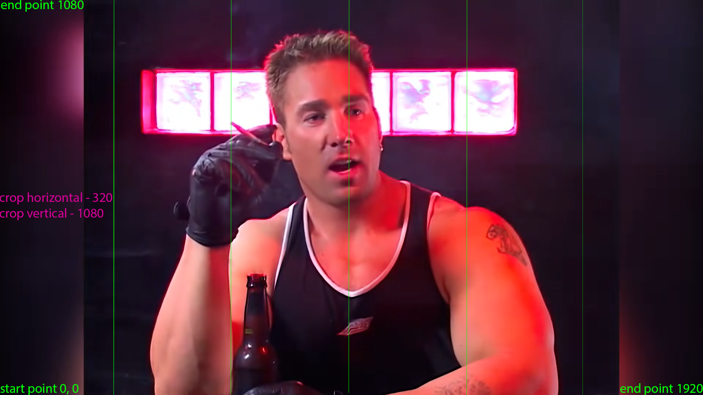

# Paradox-Animated-Background-Generator
This program can help you create an animated background for your game mod (PDX games).

First of all, the source video needs its frame rate lowered to 24 fps.

After choosing a video you will need to do some math.

Do the math
The key constraints to playing videos in Eu4 (and other pdx games) are:
1) The texture handler can’t handle anything with a dimension of over 16384 pixels
2) FrameAnimatedSpriteType only accepts single row sprite sheets

This means that for a single frameAnimatedSpriteType, [width]*[num of frames] must not exceed 16384. For a 1080p image (1920*1080), this means that there can only be 16384/1920 ~= 8 frames.

These restrictions, however, can be bypassed by replacing the menu background with multiple images:

For example separeted by green lines area is one out of the “strips”.

For example: 
Some video is 1920 pixels wide, and we have 888 frames in this video, so we have 1920*888=1704960 pixels. Each texture can only contain 16384 pixels in width, so we need at least 1704960/16384=104.0625 textures. We up that to 120, so we’ll divide the loading screen into 120 pieces of texture. Now we have to calculate the width of each frame, which is 1920/120=16 pixels. Note that if the width isn’t divisible by the number of textures in the last step, you might want to either divide the texture further to find a number divisible by the width

Then you set settings in settings corresponding to the math. and then you must select processing option in processing menu

After that program will generate files with code which you will need to paste in the corresponding files of your mod. Also you will need to copy the generated gfx folder in your mod folder. (this all will be located in folder named Final Result)

You can see this mod as example: https://steamcommunity.com/sharedfiles/filedetails/?id=2725561378

